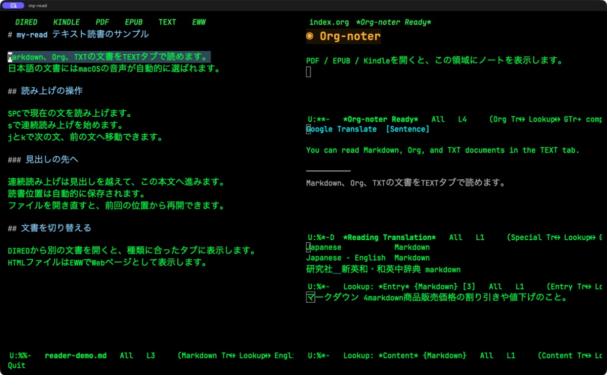
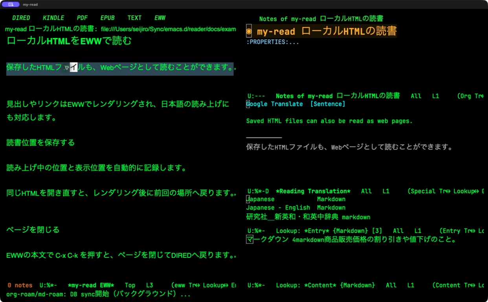
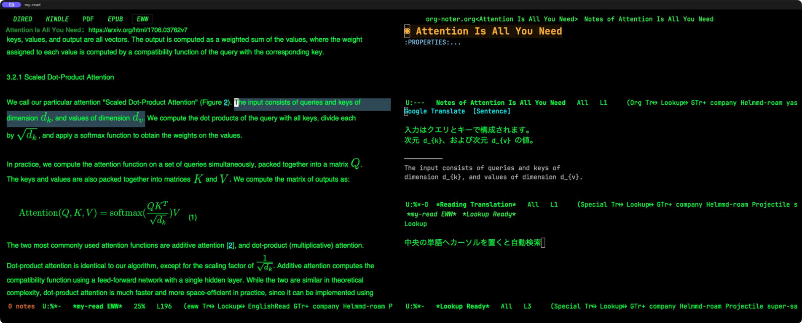
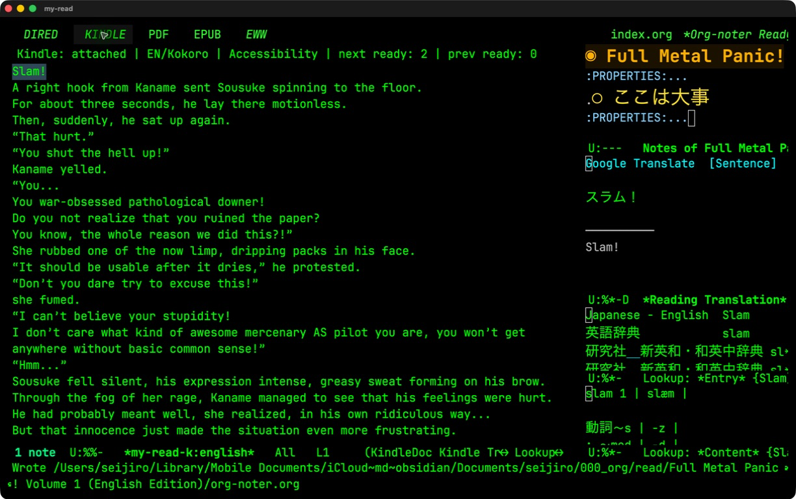
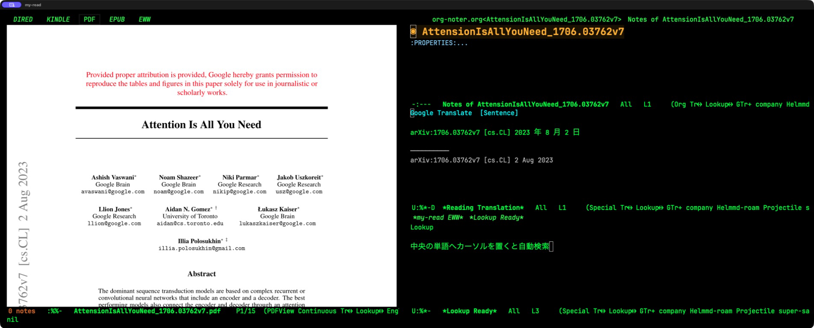
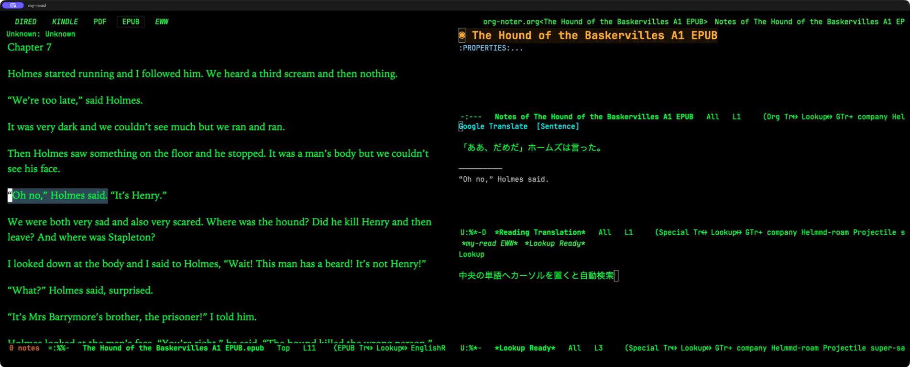

# Emacs 多言語Reader

EmacsでPDF、EPUB、Markdown・Org・TXT、HTML、Kindle.appの本を読みながら、文単位の読み上げ、翻訳、
Lookup辞書、org-noterの読書メモを一つの専用フレームにまとめるプロジェクトです。

PDFはPDF Tools、EPUBはnov.el、WebページとローカルHTMLはEWW、テキスト文書は元のメジャーモードを使います。Kindle本文はmacOS
Accessibilityから現在表示中のページだけを取得します。スクリーンショット取得、
OCR、Kindleファイルの復号は行いません。

追加の[HTTPチャンク読み上げ](docs/http-speech.md)は、ネイティブmacOSアプリからサーバーを起動・停止し、
英語・日本語のWAVを順次受信してEmacs側で連続再生できます。停止中はEmacsの読み上げ開始時に自動起動します。
`reader-http-speech-transport-mode` を有効にすると、通常の読み上げ操作と先読みもHTTP経由に切り替わります。

専用フレームは、左の読書領域と右側の3段ペインで構成されます。

- 左: タブで切り替えるDIRED、Kindle、PDF、EPUB、TEXT、EWW
- 右上: 現在の資料に対応するorg-noterノート
- 右中央: カーソル位置、または読み上げ中の1文の翻訳
- 右下: カーソル位置の単語を自動検索するLookup

## HTTP音声サーバー・ネイティブアプリ

**SSH先で読書し、音は手元へ：** 音声生成と再生を別サーバーに分離できます。
Emacs → 生成サーバー → 再生サーバーへWAVを送り、実際の再生終了をEmacsへ返します。
手元の再生サーバーにはKindleや音声モデルは不要です。
転送先はEmacsでURLを指定するだけで、生成サーバーへの事前登録は不要です。
macOS版はIntel／Apple Silicon・Monterey（12）以降を対象とする単体GUIアプリを
`make speech-playback-app` で作成できます。Pythonも同梱します（Intel／Monterey実機は未検証）。
[クロスプラットフォーム再生サーバーの導入・SSH接続手順](docs/remote-playback.md)を参照してください。


**Reader Speech Server**は、Emacsなしでも起動できるmacOSアプリです。
「サーバースタート」「停止」ボタンで音声生成サーバーを操作し、画面にLAN接続先を表示します。
Webブラウザーは不要です。EmacsやLAN内のプログラムから本文・言語・音声・速度を送り、
WAVチャンクを順番に受け取れます。

| 言語 | 音声エンジン | 既定の声 |
| --- | --- | --- |
| 英語 | Kokoro | `bf_emma`（イギリス英語） |
| 日本語 | macOS（日本語の既定） | `Kyoko` |
| 日本語 | Kokoro | `jf_alpha` |
| 日本語 | Irodori | `asuka`（参照音声が必要） |

英語はmacOS音声も指定できます。Irodoriは現在日本語のみです。
日本語Kokoroは `uv sync --extra japanese`、Irodoriは[専用のセットアップ](README-irodori.md)が必要です。
Irodoriの参照音声 `assets/asuka.wav` はリポジトリに含まれません。

### Emacsなしで起動する

Apple Silicon Macで、このリポジトリのディレクトリから実行します。
Python・uvとApple Command Line Toolsを先に導入してください。

```sh
uv sync
brew install ffmpeg
make speech-gui
```

初回はアプリを自動ビルドします。以後はFinderで
`speech-http-app/build/Reader Speech Server.app` を開いて起動できます。
アプリはこのリポジトリと `.venv` を参照するため、`.app` だけを別Macへコピーする配布形式ではありません。
GUIやEmacsを終了してもサーバーは動き続けます。停止にはGUIの「停止」を使います。

### 通常のEmacs読み上げを接続する

下記のReader導入・Emacsの `load-path` 設定後、設定ファイルへ追加します。

```elisp
(require 'reader-http-speech-transport)
(reader-http-speech-transport-mode 1)
```

通常の `s` / `SPC` と先読みがHTTP経由になります。ローカルサーバーが停止中なら自動起動します。
生成したWAVはEmacs側の常駐音声ブリッジで順番に再生し、ハイライトやページ送りも維持します。
`my-read-set-speech-language` と言語別の速度変更関数の設定は次のリクエストに反映されます。
macOS音声は語/分、Kokoro/Irodoriは速度倍率を送ります。

### LAN・外部プログラムから使う

既定の待受は **`0.0.0.0:8765`**、同じMacからの接続先は `http://127.0.0.1:8765` です。
別端末ではアプリに表示されたサーバーのLANアドレスを使います。
Emacsの接続先も変更できます。

```elisp
(setq reader-http-speech-endpoint "http://server-host:8765")
```

リモートサーバーは接続先のMacで起動してください。Emacsの自動起動はローカル接続専用です。
音声生成APIの例:

```sh
curl -N http://127.0.0.1:8765/v1/speech/stream \
  -H 'Content-Type: application/json' \
  -d '{"text":"こんにちは。音声サーバーのテストです。","language":"ja","backend":"macos","rate":300}'
```

応答はNDJSONです。`audio` イベントに順序番号とBase64形式のWAVが入り、最後に `done` が届きます。
WAVは24kHz・モノラル・PCM16です。文章単位の生成と先読みで待ち時間を減らしますが、
合成が再生に追いつかない場合は待ちが発生します。
現在のサーバーはmacOS/Apple Silicon用です。

EmacsなしのGUI起動と、同じMacからLANアドレス経由の音声取得を確認済みです。
別のLAN端末からの疎通確認は未完了です。
[詳しい起動手順・API・認証・検証結果](docs/http-speech.md)を参照してください。

## 動作画面

実際に動作中のmy-readフレームを撮影したものです。左側の
`DIRED / KINDLE / PDF / EPUB / TEXT / EWW`タブを切り替えても、右側は上から
org-noter、文単位の翻訳、Lookupの3段構成を保ちます。
TEXTとローカルHTMLは2026-09-13に、同梱サンプルを実際に開いて撮影しました。
Web論文・PDF・EPUBは2026-09-12、Kindleは2026-08-28撮影の参考画像です。
以前の画像にはTEXTタブがありません。

### TEXT: Markdown・Org・TXT

[サンプルMarkdown](docs/examples/reader-demo.md)をTEXTタブで開いた画面です。
見出しを含む本文を連続読み上げでき、読書位置を保存・復元します。
TEXTはorg-noter連携の対象外なので、右上には待機画面が表示されます。



### EWW: ローカルHTML

[サンプルHTML](docs/examples/reader-demo.html)をEWWタブで開いた画面です。
HTMLのタグを本文として読むのではなく、見出し・段落・リンクをレンダリングします。
再度開くと描画後に読書位置へ戻り、`C-x C-k`でページだけを閉じられます。



### EWW: Web論文と数式

`Attention Is All You Need`の[arXiv HTML版](https://arxiv.org/html/1706.03762v7)を
EWWで開いた画面です。本文内の数式をSVGで表示し、読書ノートと文単位の翻訳を
同じフレームで参照できます。EWWの自動Lookupは既定では無効です。



### Kindle.app

Kindle.appへAccessibilityで接続し、取得した現在ページの本文を文単位で扱っている
状態です。org-noterにはKindleの書名と位置情報を記録できます。



### PDF Tools

同じ論文のPDF版をPDF Toolsで表示しています。PDFのテキストレイヤーに沿って
文を移動し、翻訳と読書ノートを参照できます。



### EPUB

nov.elでEPUBを開き、翻訳対象の1文をハイライトしながら読書ノートと訳文を
参照している状態です。



## 主な機能

- `j` / `k` で次／前の1文へ移動
- `SPC` で現在の1文を読み上げ、`s` で連続読み上げ
- DIREDからPDF／EPUBを開き、資料種別ごとのタブへ自動登録
- ローカルHTML（`.html`／`.htm`／`.xhtml`）をEWWタブでレンダリング
- Markdown・Org・TXTなどをTEXTタブに自動登録し、見出しを越えて連続読み上げ
- テキストとローカルHTMLの読書位置を保存し、再度開いたときに復元
- EWWの`C-x C-k`でページを閉じ、my-readを残してDIREDへ戻る
- EWW・TEXT・EPUBで読み上げ言語を日本語／英語に手動指定し、自動判定へ戻す
- my-read起動時に音声エンジンを再起動し、古い再生キューを破棄
- 読み上げ中の文を対応する本文バッファ上でハイライト
- EPUB／EWW／Kindleでは読み上げ中の文頭を表示中央へ追従
- 読み上げ中は翻訳対象を読み上げ中の1文へ固定
- `l` / `;` で前／次の単語へ移動し、Lookupを追従
- PDF Toolsで選択した文を新しい読み上げ開始位置として自動採用
- PDF／EPUBのページ、表示位置、表示倍率を自動保存・復元
- PDF／EPUB／Kindle／EWWをorg-noterで統一して記録
- EWWのURL履歴からWebページを再訪し、arXiv HTMLの数式・図を表示
- `M-x my-read-change-japanese-speed` / `M-x my-read-change-english-speed` で言語別に速度を変更
- PDFの選択範囲を永続ハイライトとして保存
- Kindleでは前後2ページをメモリ上だけにキャッシュ
- Kindle本文をファイルへ保存しない
- Google翻訳を既定とし、必要に応じてローカル翻訳へ切り替え可能
- `u` で単語や選択フレーズを例文・意味・日本語訳とともにOrgへ蓄積
- 通常の自動翻訳は記録・保存しない

## 必要環境

- Apple Silicon Mac
- macOS 13以降
- Emacs 29以降
- Python 3.11以上3.14未満
- [`uv`](https://docs.astral.sh/uv/)
- Swift 6以降
- HTTP音声サーバーには `ffmpeg`、独立再生クライアントには `ffplay`（`brew install ffmpeg`）
- ネイティブ音声サーバーアプリのビルドにはApple Command Line Tools
- macOSの `/usr/bin/curl`、`/usr/bin/say`、`/usr/bin/afplay`
- ローカル翻訳を使う場合はOllamaと `translategemma:4b`
- Emacsパッケージ `google-translate`、`lookup`、`org-noter`、`pdf-tools`
- EPUBを読む場合は `nov.el`
- Markdownの表示とERTテストには `markdown-mode`
- PDFを読む場合はPopplerの `pdftotext` とPDF Toolsの `epdfinfo`
- EWWでarXiv数式を画像表示する場合はTeX Liveの `latex` と `dvisvgm`
- PDFの枠なしハイライトとEWWの透過図の背景処理にはImageMagickの `magick`
- EWWの大きなSVG図を軽量化する場合はlibrsvgの `rsvg-convert`

Kindle.appの本文取得にはmacOSのアクセシビリティ権限が必要です。Lookup本体、辞書エージェント、EPWING辞書などは別途設定してください。

PDF関連の依存パッケージはHomebrewで導入できます。

```sh
brew install poppler automake glib pkgconf imagemagick librsvg
```

## 1. Python環境と音声ブリッジの導入

```sh
cd ~/Sync/emacs.d/reader
uv sync
make my-read-speech-build
```

英語の読み上げは既定でKokoroの女性音声`bf_emma`（イギリス英語、1.0倍）を使います。
HTTP転送モードでは上記の8765番サーバーが音声を生成します。
HTTP転送モードを使わない従来方式では、Kokoroサーバーを最初の読み上げ時にEmacsから自動起動します。
従来方式の手動起動とヘルスチェックは次の通りです。

```sh
make run
curl --fail http://127.0.0.1:8000/health
```

従来方式のKokoro接続先は `127.0.0.1:8000` です。モデルは `mlx-community/Kokoro-82M-bf16`、音声は `bf_emma`、イギリス英語を使います。

`my-read-speech-bridge`は常駐するmacOSネイティブ音声プロセスです。英語・日本語の`AVSpeechSynthesizer`音声と、Kokoro使用時の
WAVを同じ順序付きキューで再生し、連続読み上げ
では音声を先行合成して文間の待ちを減らします。日本語は既定で最大2文を1区間とし、
先の6区間まで準備します。`make my-read-k-check`を実行する場合は、テスト
の前にこのブリッジも自動ビルドされます。

## 2. Emacs側の設定

```elisp
(add-to-list 'load-path
             (expand-file-name "~/Sync/emacs.d/reader"))

(require 'my-read)

(setq my/read-book-path "/path/to/books"
      my/read-vocabulary-file "~/my-read/vocabulary.org"
      my/read-org-noter-directory
      "~/my-read/notes"
      my/read-position-directory
      "~/my-read/state"
      my/read-japanese-macos-voice "Kyoko"
      my/read-japanese-macos-rate 540
      my/read-english-macos-rate 180
      my/read-eww-url "https://arxiv.org/"
      my/read-eww-line-spacing 0.5
      my/read-eww-math-enabled t
      my/read-eww-math-image-scale-multiplier 1.5
      my/read-eww-math-inline-scale-multiplier 1.25
      my/read-eww-math-image-vertical-margin 0
      my/read-eww-math-svg-stroke-width 0.18
      my/read-eww-math-svg-padding 1.0
      my/read-eww-math-max-processes 4
      my/read-eww-article-image-background "#f5f5f5"
      my/read-eww-article-svg-max-width 720
      my/read-eww-enable-automatic-lookup nil)

;; 履歴ファイルの既定値はロード時に決まるため、保存先を変えたらこちらも指定します。
(setq my/read-eww-history-file
      (expand-file-name "eww-history.el" my/read-position-directory))

(setq kokoro-reader-server-directory
      (expand-file-name "~/Sync/emacs.d/reader")
      kokoro-reader-voice "bf_emma"
      kokoro-reader-lang-code "b"
      kokoro-reader-speed 1.0
      kokoro-reader-volume 1.0)

(setq google-translate-default-source-language "en"
      google-translate-default-target-language "ja"
      my/read-translation-backend 'google
      my/read-local-translation-model "translategemma:4b"
      my/read-google-translation-fallback t
      my/read-translate-overlay-opacity 0.35)

(setq my/read-lookup-dictionary-ids
      '("nmacos"
        "ndeb+~/Sync/004_dic/ee/:simpleen"
        "ndeb+~/Sync/004_dic/chujisnd/"
        "ndspell"))

(add-hook 'nov-mode-hook #'english-reading-mode)
```

`my/read-lookup-dictionary-ids` は通常のLookup設定を変更しません。空リストにすると専用フレーム内のLookupを無効にします。

日本語を含むEPUB・PDF・TEXT・ローカルHTMLはmacOS音声へ自動的に切り替わり、既定では
`Kyoko`を毎分540語で使います。英語はKokoroの`bf_emma`を使います。

GitHubの日本語READMEなどが英語音声になる場合は、
[読み上げ言語の指定](#読み上げ言語の指定)で日本語音声へ切り替えられます。

日本語のKokoro音声も利用できます。初期設定はApple音声を維持しています。
`M-x my-read-set-japanese-speech-backend`で`kokoro`を選ぶと、開いている日本語本文も
女性音声`jf_alpha`へ切り替わります。`macos`を選べばApple音声に戻せます。
切り替え時は日本語の再生を停止するので、`s`または`SPC`で再開してください。

```elisp
;; 日本語もKokoroを既定にする場合
(setq my/read-japanese-speech-backend 'kokoro
      my/read-japanese-kokoro-voice "jf_alpha"
      my/read-japanese-kokoro-speed 1.0)
```

日本語Kokoroの導入手順は[依存関係の設定](README-kokoro-emacs.md#1-install-dependencies)を参照してください。

Irodoriの参照音声方式も追加しています。
`M-x my-read-set-japanese-speech-backend`で`irodori`を選ぶと、
`assets/asuka.wav`をもとに日本語を読み上げます。
[導入・設定・切り戻し](README-irodori.md)を参照してください。

日本語と英語の速度は個別に設定できます。

| 言語 | 設定変数（初期値） | 変更コマンド |
| --- | --- | --- |
| 日本語（Apple） | `my/read-japanese-macos-rate`（540） | `M-x my-read-change-japanese-speed` |
| 日本語（Kokoro） | `my/read-japanese-kokoro-speed`（1.0倍） | `M-x my-read-change-japanese-speed` |
| 日本語（Irodori） | `my/read-japanese-irodori-speed`（1.0倍） | `M-x my-read-change-japanese-speed` |
| 英語（Kokoro） | `kokoro-reader-speed`（1.0倍） | `M-x my-read-change-english-speed` |

Apple音声は毎分語数を正の整数、Kokoroは言語ごとの速度倍率（0.5〜2.0、通常1.0）を入力すると、
その言語の開いている読書バッファと、
以後開く文書に反映されます。対象言語を読み上げ中なら再生と先読みを停止し、
`s`または`SPC`で再開すると新しい速度を使います。他方の言語の速度は変わりません。
Apple音声を英語の既定に戻した場合は、同じコマンドで`my/read-english-macos-rate`（毎分語数）を変更します。
従来の`my-read-change-speed`は日本語用の別名として使えます。
コマンドの変更は現在のEmacsセッション内で有効です。再起動後も使う値は設定ファイルに記述してください。

```elisp
(setq my/read-japanese-macos-rate 540
      kokoro-reader-speed 1.0)
```

PDFとorg-noterをまだ導入していない環境では、次の設定も追加してください。

```elisp
(use-package org-noter
  :ensure t
  :after org
  :defer t
  :custom
  (org-noter-highlight-selected-text t))

(use-package pdf-tools
  :ensure t
  :mode ("\\.pdf\\'" . pdf-view-mode)
  :config
  (pdf-tools-install :no-query))
```

## 3. Kindle.appの準備

1. Kindle.appで英語の本を開きます。
2. 「システム設定 → プライバシーとセキュリティ → アクセシビリティ」でEmacsを許可します。
3. Emacsで `M-x my-read` を実行します。

最初の実行時に、必要であれば `my-read-k2/bridge` のSwiftブリッジをリリース構成でビルドします。先にビルドする場合は次を実行します。

```sh
make my-read-k-build
```

ブリッジは現在表示中のページを読み、先読み時だけ最大2ページ先まで一時的に移動した後、元のページへ戻します。全冊クロールや本文のファイル保存は行いません。

Kindleの正式な書名は、Kindle自身のローカル `BookData.sqlite` から接続時に
読み取り専用で自動取得します。OCRやネットワーク送信は行いません。この書名は
単語帳の `BOOK` プロパティと用例見出しに使われます。自動判定を上書きしたい場合
だけ、次のように指定してください。

```elisp
(setq my-read-k2-book-name "任意の書名")
```

## 4. 統合読書フレーム

```text
M-x my-read
```

左側は同じ1ペインの `DIRED` / `KINDLE` / `PDF` / `EPUB` / `TEXT` / `EWW` タブで
切り替えます。起動時は`my/read-book-path`のDIREDを開き、そこから文書を
選ぶとPDF／EPUB／TEXT／EWWの対応タブへ登録して表示します。`C-c t`で次のタブへ移動します。
EWWタブでは`g`で初期URL（既定はarXiv）、`G`で任意のURLを開けます。Kindleへ
接続し直す場合はKINDLEタブで`r`を押します。

EWWタブを開くと、最近表示したページのタイトルとURLを最大100件まで一覧表示します。
履歴は`my/read-position-directory/eww-history.el`へ保存され、同じURLを再訪した場合は
重複せず最新位置へ移動します。

EWW全体の行間は`my/read-eww-line-spacing`の既定値`0.5`により通常のおよそ
1.5倍です。arXiv HTMLのTeX注釈はバックグラウンドでSVGへ変換されます。
EWWのロード中表示を同期型辞書へ送るとEmacs全体を止めることがあるため、
EWWタブでは自動Lookupだけを既定で停止しています。必要なら
`my/read-eww-enable-automatic-lookup`を`t`にしてください。

PDF・EPUB・テキスト・ローカルHTMLの読書位置は、操作が止まってから1秒後と
バッファを閉じるときに
`my/read-position-directory/read-positions.el`へ保存され、次に開いたとき自動的に
復元されます。PDFではページ、表示倍率、縦スクロール位置、EPUBでは章、本文位置、
表示開始位置を記録します。テキストとローカルHTMLでは本文位置と表示開始位置を
保存し、連続読み上げ中も各区間の開始位置を記録します。HTMLはレンダリング後に
復元します。`SPC`または`s`で再開できます。文書の編集や表示幅の変更で本文位置が
変わった場合は、復元位置がずれることがあります。HTTP(S)ページの読書位置保存は
対象外です。壊れた位置ファイルを検出した場合は上書きしません。

`s`の連続読み上げはEPUBの章境界とPDFのページ境界を越えて進みます。EPUB、EWW、
Kindleでは読み上げ中の文頭が読書ペインの中央付近へ来るよう表示を追従します。
PDFの連続読み上げでは、読み上げ箇所をPDF座標から求め、既定では読書ペインの
上から20%付近へ追従します。`english-reading-mode-pdf-speech-screen-position`で
位置を調整できます。日本語音声は最大2文ずつ、先の6区間までバックグラウンドで
準備します。手動でPDFを移動した場合は、意図しない自動移動を防ぐため連続読み上げを
停止します。

### EWW: Webページ・arXiv論文

1. `C-c t`でEWWタブへ切り替えます。初期画面には保存済みの閲覧履歴が表示されます。
2. `G`でURLを入力するか、履歴のタイトル／URLにカーソルを置いて`RET`を押します。
3. 本文では`j` / `k`で文を移動し、`SPC`で1文、`s`で現在のWebページを連続読み上げします。
4. `C-c o`で資料に対応するノートを表示し、`i`で現在位置にノートを作れます。

`g`はEWW標準の再読み込みです。初期の履歴画面では、表示されている初期URLを
開きます。Webページの読み上げがリンク先へ自動で巡回することはありません。

arXiv HTMLのMathMLに含まれるTeX注釈を、`latex`と`dvisvgm`で数式画像へ変換します。
既定では最大4式を並列処理し、表示位置を保って順次置き換えます。結果は
`my/read-eww-math-cache-directory`へキャッシュされます。ツールがない場合は
TeX文字列を表示します。変換対象は既定でarXivのHTTPSページに限定されます。

論文中の図には明るい背景を付け、暗いテーマでも文字や線を見やすくします。
複雑なSVG図は`rsvg-convert`で画像化し、EWWの幅の95%、最大720ピクセルに収めます。
数式・サイトのアイコン・ロゴはこの図の処理の対象外です。

| 設定 | 既定値・用途 |
| --- | --- |
| `my/read-eww-history-limit` | 履歴を最大100件保存 |
| `my/read-eww-line-spacing` | `0.5`。通常の約1.5倍の行間 |
| `my/read-eww-math-max-processes` | 数式を最大4式並列変換 |
| `my/read-eww-article-image-background` | 図の背景色 `#f5f5f5` |
| `my/read-eww-article-svg-max-width` | SVG図の最大幅720ピクセル |
| `my/read-eww-enable-automatic-lookup` | `nil`。自動Lookupを停止。翻訳は有効 |

### PDF Tools

PDFを開くと`pdf-view-mode`と`english-reading-mode`が連携します。PDF表示は
PDF Toolsに任せ、`pdftotext`で抽出した本文を裏側の仮想カーソルで文単位に
移動します。`j` / `k`は次／前の文へ移動し、ページ境界では表示ページも
切り替わります。`C-v` / `M-v`は文位置に関係なく次／前のPDFページへ移動します。
PDF Tools付属の`pdf-view-roll-minor-mode`も自動で有効になり、Preview.appのように
ページ境界をまたいで縦へ連続スクロールできます。無効にする場合は
`my/read-pdf-continuous-scroll`を`nil`にしてください。

PDF Toolsで本文をマウス選択すると、選択文字列とページ上の縦位置から対応する文を
特定し、読み上げ位置をその文へ自動的に移します。続けて`SPC`を押すとその文だけ、
`s`を押すとその位置から連続して読み上げます。同じ文がページ内に複数ある場合は、
選択位置に最も近いものを使います。

英語はKokoroの`bf_emma`、日本語を多く含むPDFは自動判定してmacOSの日本語音声
（既定は`Kyoko`、毎分540語）を使います。PDFのテキストレイヤーがないスキャンPDFは、
現在の実装ではOCR対象外です。

### org-noter

my-read開始時に現在のPDF／EPUB／Kindle／EWWに対応するorg-noterセッションを開き、
右上へノートを表示します。保存先の既定値は次のディレクトリです。

```text
/Users/seijiro/Library/Mobile Documents/iCloud~md~obsidian/Documents/seijiro/000_org/read
```

資料ごとのサブディレクトリに`org-noter.org`を作成します。Kindleノートには
`NOTER_PAGE`に加えて`KINDLE_LOCATION`と`KINDLE_FINGERPRINT`を記録します。
EWWではフラグメントを除いたURLを資料IDとし、ページ内見出しと本文オフセットで
ノート位置を同期します。

PDFへ永続ハイライト付きのノートを作る手順は次のとおりです。

1. PDF本文をマウスで選択します。
2. 選択を残したまま`i`を押してorg-noterノートを作ります。
3. `C-x C-s`でPDFを保存し、ハイライトをPDFファイルへ書き込みます。

`C-u i`を使うと、その1回だけハイライト設定を反転できます。

### Kindleのページ方向

英語の横書き・日本語の縦書きとも、同じ操作で読み進められます。
「次へ」はKindleにPage Down、「前へ」はPage Upを送り、本の綴じ方向を
Kindle側で処理します。連続読み上げ、先読み、先読み後の元ページへの復帰も
同じ方式です。読み上げ言語を変更してもページ送りの方向には影響しません。

### 読み上げ言語の指定

GitHubなどでサイト側の言語が英語でも、本文が日本語なら手動で日本語音声を
指定できます。my-readの**KINDLE・EWW・TEXT・EPUB本文にカーソルを置いて**実行してください。

| コマンド（`M-x`） | 動作 |
| --- | --- |
| `my-read-use-japanese-speech` | 日本語のmacOS音声に固定。設定済みの音声・速度を使用 |
| `my-read-use-auto-speech` | 手動指定を解除し、本文から言語を自動判定 |
| `my-read-set-speech-language` | `ja`（日本語）・`en`（Kokoro英語）・`auto`（自動判定）から選択 |

日本語READMEを読む手順:

1. EWWでREADMEを開き、左側の本文ペインへ移動します。
2. `M-x my-read-use-japanese-speech`を実行します。
3. `s`で連続読み上げ、または`SPC`で現在の1文を読み上げます。

言語変更時には現在の再生と先読みキューを停止します。言語を変えただけでは
再生を始めないので、`s`または`SPC`で再開してください。

指定はバッファ単位です。Kindleのページ送りや再取得、同じEWWタブでのページ移動・再描画でも維持されます。
Kindleで自動判定へ戻すと、Kindleから取得した言語を使います。
英語ページへ移ったら`my-read-set-speech-language`で`en`を選ぶか、
`my-read-use-auto-speech`で自動判定へ戻してください。バッファを閉じると指定は
解除され、ディスクには保存しません。PDFにはこの手動指定コマンドを適用しません。

Emacs Lispから指定する場合の引数はシンボルです。

```elisp
(my-read-set-speech-language 'ja)  ; 日本語に固定
(my-read-set-speech-language 'en)  ; Kokoro英語に固定
(my-read-set-speech-language nil)  ; 自動判定に戻す
```

### 音声関連のコマンド

| コマンド（`M-x`） | 動作 |
| --- | --- |
| `my-read-change-japanese-speed` / `my-read-change-speed` | 日本語音声の毎分語数を変更 |
| `my-read-change-english-speed` | 英語音声の速度を変更（Kokoroは倍率、macOSは毎分語数） |
| `my-read-set-japanese-speech-backend` | 日本語の音声エンジンを選択（kokoro / irodori / macos） |
| `my-read-set-english-speech-backend` | 英語の音声エンジンを選択（kokoro / macos） |
| `my-read-restart-japanese-speech` | 音声エンジンを再起動し、現在の再生・先読みを停止 |

バックエンドの選択は現在のEmacsセッションに適用され、開いている同じ言語の本文にも反映されます。
変更した言語の読み上げは停止するため、`SPC`または`s`で再開してください。

`my-read`の起動時にも音声エンジンを再起動します。音声が応答しない場合は
上記の再起動コマンドを使い、その後`SPC`または`s`で読み上げを再開できます。

### キーバインド

| キー | 動作 |
| --- | --- |
| `j` | 次の1文へ移動 |
| `k` | 前の1文へ移動 |
| `SPC` | 現在の1文を読み上げ |
| `s` | 現在位置から連続読み上げ。日本語は最大2文ずつ。もう一度押すと停止 |
| `l` | 前の単語に移動 |
| `;` | 次の単語に移動 |
| `p` | 次のLookup辞書エントリへ切り替え |
| `o` | 前のLookup辞書エントリへ切り替え |
| `i` | org-noterで現在位置へノートを挿入 |
| `↓` / `C-n` | 1表示行下へ。末尾では次のKindleページへ |
| `↑` / `C-p` | 1表示行上へ。先頭では前のKindleページへ |
| `C-v` | 次のPDF／Kindleページ |
| `M-v` | 前のPDF／Kindleページ |
| `C-c ]` / `C-c [` | 次／前のKindleページ |
| `C-c g` | 現在ページを再取得 |
| `C-c C-k` / `C-c k` | 合成または再生を停止 |
| `u` | 単語、または選択中のフレーズを語彙Orgファイルへ保存 |
| `C-c o` | 現在資料のorg-noterノートを表示 |
| `C-c t` | DIRED／KINDLE／PDF／EPUB／TEXT／EWWタブを順に切り替える |
| `r` | Kindle.appへ再接続 |
| `C-x C-k`（EWW） | 読書位置を保存してページを閉じ、DIREDへ戻る。my-readは維持 |
| `C-x k`（PDF） | PDFだけを閉じてDIREDへ戻る。my-readは維持 |
| `G`（EWW） | URLを入力して開く |
| `g`（EWW） | ページを再読み込み。履歴画面では初期URLを開く |

TEXTタブには最後に開いたテキストファイルが表示されます。読書中は読み取り専用です。
編集するときは`M-x english-reading-mode`で解除します。

`M-x my-read`は起動のたびに音声エンジンを再起動します。音声が応答しない場合は
`M-x my-read-restart-japanese-speech`でも手動で再起動できます。再起動は現在の
読み上げと先読みを停止します。音声検索結果はプロセス内で再利用されます。

`M-x my-read-change-speed`で日本語の速度を変更し、`M-x my-read-end`で
専用フレームとバックグラウンド処理を終了できます。

my-read固有キーは、my-readフレームの左側読書ペインにカーソルがある場合だけ
有効です。右側のOrgバッファや通常のEmacsバッファには影響しません。org-noterの
詳細な標準キーと競合方針は[key.md](key.md)を参照してください。`o` / `p`は
右下のLookupペインで前／次の辞書エントリを選びますが、入力フォーカスは左側の
読書ペインに維持されます。

### PDFの表示倍率

| キー | 動作 |
| --- | --- |
| `+` / `=` | PDFを拡大 |
| `-` | PDFを縮小 |
| `0` | 表示倍率をリセット |
| `W` | PDFの横幅をウィンドウへ合わせる |
| `H` | PDFの高さをウィンドウへ合わせる |
| `P` | ページ全体をウィンドウへ合わせる |
| `C-マウスホイール` | マウス操作で拡大／縮小 |

`C-+` / `C--`は現在のEmacs設定では文字サイズ変更に使われるため、PDFの拡大・
縮小には修飾なしの`+` / `-`を使います。

## 単語・フレーズの保存

左側のKindle／EPUB／PDF／EWW読書ペインで `u` を押すと、覚えておきたい
単語やフレーズを `my/read-vocabulary-file` のOrgファイルへ保存します。このキーは
`my-read` の読書ペイン内だけで有効で、通常のEmacsバッファの `u` には影響しません。
同じ操作は `M-x my/read-vocab-capture` でも実行できます。

- リージョンが有効な場合: 選択範囲全体をフレーズとして保存
- リージョンから保存を開始した後は選択状態を自動解除
- リージョンがない場合: カーソル位置の単語を保存
- 選択範囲内の改行や連続空白は1個の空白へ正規化
- 大文字小文字と周辺の句読点を無視して既存項目を検索
- 同じ単語・フレーズを再登録すると、見出しを増やさず新しい用例を追加

既定の保存先は次のファイルです。ファイルと親ディレクトリは初回保存時に
自動作成されます。

```elisp
(setq my/read-vocabulary-file "~/my-read/vocabulary.org")
```

各項目には、次の情報を保存します。

- 単語またはフレーズ
- 既存のmy-read Lookupで得られた英英辞書の定義
- 既存のmy-read Lookupで得られた英和辞書の定義
- 単語または選択フレーズ自体のGoogle翻訳
- 遭遇日時
- Kindleの書名、EPUB／PDFのファイル名、またはEWWのページタイトル
- 単語・フレーズを含む英語の1文
- 既存のmy-read翻訳バックエンドによる日本語訳
- 安価に取得できる場合は、ファイルパスやURLなどの参照元

Orgファイルでは、正規化後の単語・フレーズごとにトップレベル見出しを1個だけ
作ります。再登録時は `COUNT` と `UPDATED` を更新し、`Examples` の下へ用例を
追加します。

```org
* anxiety
:PROPERTIES:
:TYPE: word
:CREATED: [2026-08-23 Sun 07:20]
:UPDATED: [2026-08-23 Sun 07:26]
:COUNT: 2
:END:

** Meaning
English-English [English]:
anxiety | a feeling of worry, nervousness, or unease.

English-Japanese [Japanese - English]:
名詞 不安、心配。

Google Translate:
不安

** Examples

*** [2026-08-23 Sun 07:20] Some Light Novel Vol. 1
:PROPERTIES:
:BOOK: Some Light Novel Vol. 1
:END:

English:
She felt a strange anxiety about what would happen next.

Japanese:
彼女は次に何が起こるのか、妙な不安を感じていた。
```

Lookupや翻訳が利用できない場合も登録自体は中止せず、取得できた情報だけを
保存します。カーソル位置に単語がなく、リージョンもない場合は何も書き込まず
`No word or phrase at point` と表示します。既存項目の `COUNT` や `Examples` が
壊れていて安全に更新できない場合も、元のファイルを変更せずエラーを報告します。

英英・英和辞書はLookupの辞書タイトルから判定します。辞書タイトルが既定の
`English`、`Japanese - English`、`英語辞典`、英和・和英を含むタイトルと異なる
場合は、次の正規表現を環境に合わせて変更できます。

```elisp
(setq my/read-vocab-english-dictionary-title-regexp
      "\\`English\\'\\|英英\\|英語辞典"
      my/read-vocab-japanese-dictionary-title-regexp
      "Japanese[[:space:]]*-[[:space:]]*English\\|英和\\|和英")
```

例文の日本語訳は `my/read-translation-backend` の設定に従いますが、Meaning内の
単語・フレーズ訳は常にGoogle翻訳を使います。既存項目を再登録した場合は、用例の
追加と同時にMeaningの3ブロックも最新結果へ置き換えます。

## Google翻訳とローカル翻訳

既定ではGoogle翻訳を使います。ローカルのOllamaでTranslateGemma 4Bを
使いたい場合は、最初に次を実行してください。

```sh
brew install --cask ollama
ollama pull translategemma:4b
```

そのうえで、次の設定に変更します。

```elisp
(setq my/read-translation-backend 'local)
```

ローカル翻訳では、カーソルを含む1文だけを
`http://127.0.0.1:11434/api/chat` へ送ります。読み上げ中は対象を
読み上げ中の1文へ固定し、終了するとカーソル位置へ戻ります。

Ollamaが未起動、タイムアウト、または不正な応答を返した場合だけGoogle翻訳へ
自動的にフォールバックします。Googleへ送信したくない場合は
`my/read-google-translation-fallback` を `nil` にしてください。既定のGoogle翻訳へ
戻す場合は `my/read-translation-backend` を `google` に設定します。

通常の自動翻訳は画面に表示するだけで、原文・訳文ともファイルには記録しません。
ただし、読書ペインで `u` を押して明示的に語彙登録した場合は、その用例の
英語原文と日本語訳を `my/read-vocabulary-file` へ保存します。

## 状態確認

```text
M-x my-read-k-status
M-x my-read-k-show-last-error
M-x my/read-lookup-status
M-x my/read-lookup-list-dictionaries
M-x my/read-translation-lock-status
```

Kindle.appへ接続できない場合は、Kindle.appで英語本文が表示されていることと、Emacsへアクセシビリティ権限が付与されていることを確認してください。

## テスト

```sh
make my-read-k-check
```

`make my-read-k-test` はKindle.app AccessibilityブリッジのSwiftテスト、`make my-read-k-ert` はEmacs ERTテストを実行します。

HTTPサーバー・クライアントとEmacsの設定反映は、次で検証できます。

```sh
make speech-http-test
```

分離再生は `make speech-playback-test` で検証できます。
全体の検証は `make reader-test`、Elispの構文・警告をエラー扱いにしたコンパイルは
`make reader-check` です。ReaderのERTはcheckoutのソースを明示的に読み、手元の古い
`.elc`やnative cacheがテスト対象に混ざることを防ぎます。
リファクタリングの前後比較は[検証記録](docs/refactor-validation.md)、実行環境と
Swiftビルドの回避経路は[開発ガイド](DEVELOPMENT.md#検証)を参照してください。
実音声とLAN接続の確認範囲は[HTTPサーバーの検証記録](docs/http-speech.md#検証)に記載しています。

今回のmodule分離を既存Emacsへ反映するには、`M-x my-read-end` の後にEmacsを再起動し、
`M-x my-read` を実行してください。`my-read.el`だけの再評価では、読み込み済みの依存moduleは
再読み込みされません。設定名・キーバインド・保存データ形式は維持しています。

## ファイル構成

| ファイル | 役割 |
| --- | --- |
| `speech_http/` | HTTP音声生成、WAV受信・再生、launchdサービス管理 |
| `reader-http-speech-transport.el` | 通常のReader読み上げ・先読みをHTTPへ接続 |
| `reader-http-speech.el` | 独立した文字列の読み上げ・GUI起動コマンド |
| `reader-http-playback.el` | 手元の再生サーバーへの接続・再生完了通知 |
| `speech_http/playback.py` | モデル不要のHTTP/WebSocket再生サーバー |
| `requirements-playback.txt` | 再生専用のクロスプラットフォーム依存関係 |
| `speech-http-app/` | ネイティブGUIアプリのソースとアイコン |
| `scripts/build_speech_app.py` | macOSアプリのビルド |
| `scripts/check_speech_server.py` | LAN端末からの音声生成・WAV検証 |
| `kokoro_server.py` | ローカルKokoro HTTPサーバー |
| `kokoro-reader.el` | 非同期音声生成・再生・ハイライト |
| `macos-speech-bridge/main.m` | Kokoro WAVとmacOS音声を順序付きで再生する常駐ネイティブブリッジ |
| `english-reading-mode.el` | 公開コマンド、keymap、minor-modeの有効化・終了 |
| `english-reading-speech.el` / `english-reading-prefetch.el` | 発話context、連続読み上げ、実再生完了、音声先読み |
| `english-reading-state.el` | 読み上げ設定、公開hook、sessionと文書bufferの状態宣言 |
| `reader-document.el` / `reader-document-text.el` / `reader-document-epub.el` | 文書操作API、TEXT/Markdown、EPUBの文・位置・章送り |
| `english-reading-pdf.el` / `english-reading-pdf-view.el` | PDF抽出・仮想cursorと、highlight・scroll表示 |
| `my-read.el` / `my-read-core.el` | 起動・終了、workspace所有関係、共通window API |
| `my-read-ui.el` / `my-read-pdf.el` / `my-read-eww.el` | frameと固定タブ、PDF/EWWのworkspace統合 |
| `my-read-position.el` / `reader-state-file.el` | 読書位置の保存復元とatomicな状態ファイルI/O |
| `my-read-translation.el` / `my-read-lookup.el` / `my-read-vocabulary.el` | 翻訳、辞書pane、Org語彙保存 |
| `my-read-speech-settings.el` | 言語別backend・voice・速度とbufferへの反映 |
| `my-read-eww-math.el` | EWWのarXiv数式を非同期・並列変換し、SVGをキャッシュ |
| `my-read-org-noter.el` | PDF／EPUB／Kindle／EWWのorg-noter統合と保存先管理 |
| `my-read-k.el` | Kindle本文バッファ、ページ移動、メモリキャッシュ |
| `my-read-k2.el` | Kindle.app Accessibilityバックエンド |
| `my-read-k2/bridge/` | macOS Accessibilityを読むSwiftブリッジ |
| `key.md` | my-readとorg-noterのキーバインド・競合方針 |
| `test/my-read-k-tests.el` | 共有Reader UIのERTテスト |
| `test/my-read-k2-tests.el` | Kindle.appバックエンドのERTテスト |
| `test/reader-document-tests.el` | 文書API、状態遷移、古いcallback、保存失敗の境界テスト |
| `scripts/check-reader.el` | 全Elispの構文と警告をエラー扱いにしたコンパイル検証 |

詳細は [README-my-read-k2.md](README-my-read-k2.md) と [README-kokoro-emacs.md](README-kokoro-emacs.md) を参照してください。
設計・状態所有・拡張方法は [architecture.md](docs/architecture.md)、
[state-inventory.md](docs/state-inventory.md)、[DEVELOPMENT.md](DEVELOPMENT.md) に記載しています。

## ライセンス

[MIT License](LICENSE)
