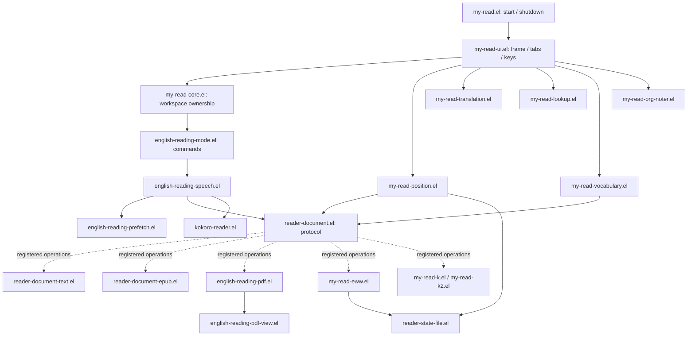

# Reader architecture

Readerは **Document → Sentence → Reading State → Speech / Translation / Notes**
を中心とします。公開コマンドと設定名を維持したまま、2026-09-18に責務を分離しました。

## ディレクトリ構成

実装の入口は [my-read/](../my-read/README.md) です。概念とディレクトリを対応させています。

```text
my-read/
├── core/                       # 起動・終了、Reading State、公開mode
├── ui/                         # frame・window・tab・paneのキー
├── document/                   # 文書操作API
│   ├── pdf/                    # 抽出・仮想cursor・表示
│   ├── epub/                   # 文境界・章送り
│   ├── eww/                    # HTML・履歴・文書adapter
│   ├── text/                   # TEXT / Markdown
│   └── kindle/                 # 本文・AX接続・ページcache
├── speech/
│   ├── backend-selection/      # 言語別backend・voice・rate
│   ├── synthesis/              # 合成要求・常駐bridgeとのqueue境界
│   ├── http/                   # HTTPコマンド・transport
│   ├── prefetch/               # 先読み・補充
│   └── playback/               # 再生session・文送り・remote再生
├── translation/                # 翻訳要求・表示・追従
├── lookup/                     # 辞書pane・追従
├── notes/                      # org-noter連携
├── vocabulary/                 # 語彙capture・Orgへのmerge
├── position/                   # 位置保存・復元・atomic file I/O
└── integrations/               # EWW数式・独立した旧TTS補助
```

ルートの互換入口は `reader-load-path.el` を読み、各ディレクトリの実装へ委譲します。
実行時のPython・Swift・native bridgeの基準位置は `reader-root-directory` です。

## 全体構成



図の実線は主な利用方向、破線は登録された関数へのdispatchです。全requireを
列挙した図ではありません。外部パッケージの可変状態は利用するファイルで宣言し、
任意依存の呼び出しは `declare-function` で境界を明示します。

| モジュール | 所有する責務とAPI |
| --- | --- |
| `my-read/core/my-read.el` | `my-read`, `my-read-end`、frame削除時の終了処理 |
| `my-read/core/my-read-core.el` | frame/windowの所有関係、読書ウィンドウの文取得 |
| `my-read/ui/my-read-ui.el` | 固定タブ、レイアウト、pane限定キー、各機能の初期化 |
| `my-read/document/pdf/my-read-pdf.el` | PDF Toolsの表示修復・roll設定・PDFだけを閉じる操作 |
| `my-read/document/eww/my-read-eww.el` | EWW描画・履歴・ローカルHTML・EWWの文書メタデータ |
| `my-read/position/my-read-position.el` | save/restoreのタイミング、レコードのmerge、保存先設定 |
| `my-read/translation/my-read-translation.el` | Google/local選択、curl、翻訳表示、音声中の対象固定 |
| `my-read/lookup/my-read-lookup.el` | 私有辞書module、Lookup follower、辞書pane操作 |
| `my-read/vocabulary/my-read-vocabulary.el` | 語彙の収集、意味・例文の取得、Orgへのmerge |
| `my-read/speech/backend-selection/my-read-speech-settings.el` | 言語判定、手動override、言語別backend/voice/rate |
| `my-read/notes/my-read-org-noter.el` | 既存org-noterへの文書別位置adapterとsession追従 |
| `my-read/integrations/my-read-eww-math.el` | LaTeX/MathML変換、process並列数、世代付き画像cache |
| `my-read/core/english-reading-state.el` | 読み上げ設定、公開hook、音声sessionとPDF buffer-local状態 |
| `my-read/core/english-reading-mode.el` | 既存interactive command、keymap、minor-mode lifecycle |
| `my-read/speech/playback/english-reading-speech.el` | context、連続読み上げ、実再生完了、session timer |
| `my-read/speech/prefetch/english-reading-prefetch.el` | 発話と同じ分割規則による先読み、定期補充 |
| `my-read/document/pdf/english-reading-pdf.el` | pdftotext、仮想cursor、ページ境界、PDF文書操作 |
| `my-read/document/pdf/english-reading-pdf-view.el` | bbox照合、画像overlay、roll/recenter、遅延highlight |
| `my-read/document/text/reader-document-text.el` | sentence bounds、Markdown見出し、text位置・metadata |
| `my-read/document/epub/reader-document-epub.el` | 日本語対話の文境界、EPUB spine横断、章と位置の復元 |
| `my-read/integrations/english-reader-tts.el` | 既存の独立した外部TTS補助。通常Readerとは別の互換経路 |

## Reading Coreと文書API

`reader-document-register` は名前・predicate・操作plist・任意の親backendを登録します。
predicateは表示元のcurrent bufferで評価します。再登録は優先順位を保持します。
TEXTの汎用処理をPDF/EPUB/EWW/Kindleが継承し、異なる操作だけ差し替えます。

公開APIは `reader-document-current-sentence`, `reader-document-next-sentence`,
`reader-document-previous-sentence`, `reader-document-current-location`,
`reader-document-restore-location`, `reader-document-title`, `reader-document-source` です。
未対応の操作は `reader-document-has-p` で確認できます。位置レコードはbackendが所有し、
Persistenceは中身を解釈せず保存します。現行のversion 1と保存キーは維持します。

| 操作 | 契約 |
| --- | --- |
| `:bounds` | current bufferの `(BEG . END)` またはnil。prefetchにも同じ規則を使う |
| `:sentence` | `(TEXT BUFFER BEG END)` またはnil。PDFは隠れた抽出bufferを返す |
| `:next`, `:previous` | 文cursorを移動する。発話はしない |
| `:speak`, `:continue` | 一文/一区間の発話、媒体境界を含む連続送り |
| `:speech-spec`, `:resume` | chunkの確定、完了したchunkの直後からの再開 |
| `:owns-speech`, `:speech-range` | 抽出bufferの所有関係、PDFページを跨がない範囲 |
| `:prepare` | 連続読み上げ開始前の媒体cursor同期 |
| `:title`, `:source` | cheapなタイトル・file/URL取得。ネットワークを使わない |
| `:location`, `:restore`, `:persistent-type` | 保存・復元、保存対象かどうか |
| `:refresh` | Kindleのように再取得を必要とする媒体の任意操作 |

UIに固定タブを追加する変更は `my-read/ui/my-read-ui.el`、文書の読取りや位置処理の変更はbackendに
置きます。PDF/EWWのcloseはframeとorg-noterのwindow所有を扱うためworkspace側の
adapterに残します。org-noter固有のlocation型も同ファイルの既存adapterで維持します。

## Speech architectureとremote playback

`my-read/speech/playback/english-reading-speech.el` は発話contextと文送りを所有し、`my-read/speech/synthesis/kokoro-reader.el` の既存
開始/停止advice・player finish hookを利用します。backendの声・速度設定は発話元bufferに
適用します。合成と実再生の完了は区別し、HTTP完了から直接次の文へ進めません。

```text
sentence / chunk
  → kokoro-reader queue (id, normalized text, voice, rate, volume)
  → synthesis (local API or reader-http-speech-transport)
  → ordered playback reservation / chunks
  → actual audio device
  → finished event
  → speech context finish hook
  → next document chunk
```

`my-read/speech/http/reader-http-speech.el` は独立したHTTP発話コマンドと設定、transportは通常Readerの
先読みqueueへの接続、`my-read/speech/playback/reader-http-playback.el` はremote sessionとdelivery capabilityを
担当します。`speech_http/server.py` と `delivery.py` は合成と転送、`playback.py` と
`playback_queue.py` は受信順序・重複・cancel・device clockに基づく完了を扱います。
`remote_bridge.py` はEmacsからのJSON LinesをWebSocketへ接続します。

`macos-speech-bridge/main.m` の常駐再生、`speech-http-app/` と `playback-app/` のGUI、
Swift Accessibilityブリッジは、既存の分離が有効なため書き換えていません。
詳細なwire protocolは [http-speech.md](http-speech.md) と
[remote-playback.md](remote-playback.md) を参照してください。

## Translation / Lookup / Vocabulary / Notes

Googleが既定で、local/Ollamaは明示選択時のみです。翻訳は発話contextの正確なboundsに
固定し、非英語発話中の自動翻訳抑止を維持します。翻訳のsentinelはprocess identity、
frame/window/bufferの生存、表示中の文書identity、翻訳targetを確認します。
停止時はprocess変数を先に無効化して、削除sentinelからのfallbackを防ぎます。

LookupはReader専用の辞書moduleを使い、通常frameの辞書設定を復元します。
Vocabularyは文書APIでtitle/sourceを取得し、既存のOrgキー・meaning・exampleのmergeを
維持します。Notesはorg-noter sessionと表示元file/URLの一致を確認し、再利用EWW bufferが
別URLになった際に古いsessionを引き継がないようにします。

## 状態とライフサイクル

宣言一覧は [state-inventory.md](state-inventory.md) にあります。

| 所有者 | 状態 | 寿命・解放 |
| --- | --- | --- |
| 文書buffer | sentence設定、言語override、PDF抽出・bbox、position timer | mode終了/killで解放、保存timerはframe終了でも取消 |
| frame | tab/source/window parameter、翻訳overlayとutility buffer | frame削除で保存・overlay除去・一時buffer削除 |
| 単一音声session | active context、continuous plist、watch/warmup/prefetch timer | stopでgeneration更新・timer取消・queue破棄 |
| 常駐音声接続 | process、JSON fragment、予約queue/id | 切断・再起動時に接続のidentityで古いeventを拒否 |
| Kindle接続 | process、request id/callback、page generation、前後cache | detach/reconnectでcallback・cacheを破棄 |
| 翻訳/Lookup follower | 選択中target、idle timer、私有module | 最後のReader frameを閉じると停止 |
| EWW数式 | buffer-local process queue/generation | 再描画/kill時に世代を変え、古い結果を拒否 |

音声出力とKindle.app接続は元から一つの共有resourceです。これをbuffer-localへ機械的に
変更すると並行音声や誤ったcancelを生むため、単一sessionのglobal状態を維持しています。
buffer-localな状態と共有resourceを巨大なstate objectへ混在させていません。

起動はentry → workspace frame → subsystem → document登録。終了は位置保存 →
該当frameの音声停止 → buffer保存timer解除 → overlay/一時buffer解除 → 最後のframeの
follower・noter timer停止です。文書bufferのkillでは、その文書が所有する音声だけを
停止します。別bufferのmode無効化は無関係な再生を止めません。

遅延した連続送り・warmup・prefetch timerは作成時generationを保持します。再生対象の
bufferが同じでもsource URLが変わればdocument identityが変わります。古いbridge processの
filter出力は新しい接続のfragmentへ混ぜません。

## Persistenceと互換性

`my-read/position/reader-state-file.el` が検証付きreadと同じディレクトリでのatomic rename、mode 600、
失敗時のtemporary file除去を共通化します。不正な既存データは `:invalid` として保護し、
自動で上書きしません。読書位置は現行の `read-log/read-positions.el`、noterは `read` を
既定とし、既存ユーザー設定が優先します。保存先の自動移動は行いません。

旧 `my/read-*`・`english-reading-mode-*` command、設定、hook、keymapは保持しました。
内部関数も移動後の定義または少数の位置復元aliasで維持しています。履歴用の `old/` と
追跡済みテスト `.elc` は削除し、実装の複製を残していません。
実際の検証結果と修正点は [refactor-validation.md](refactor-validation.md) を参照してください。
